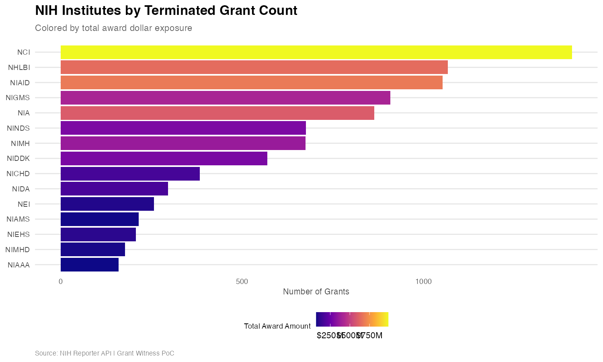
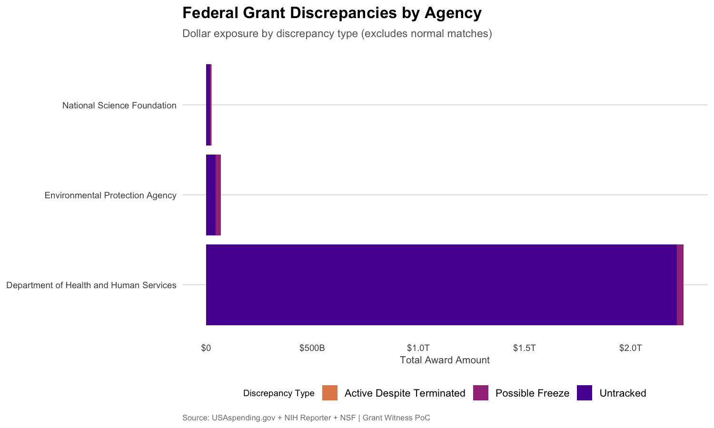
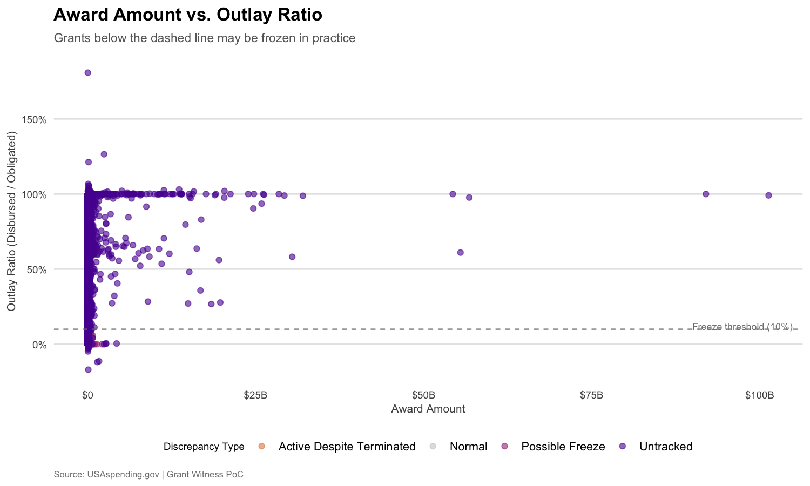
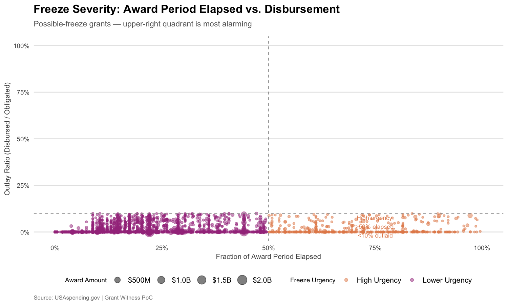
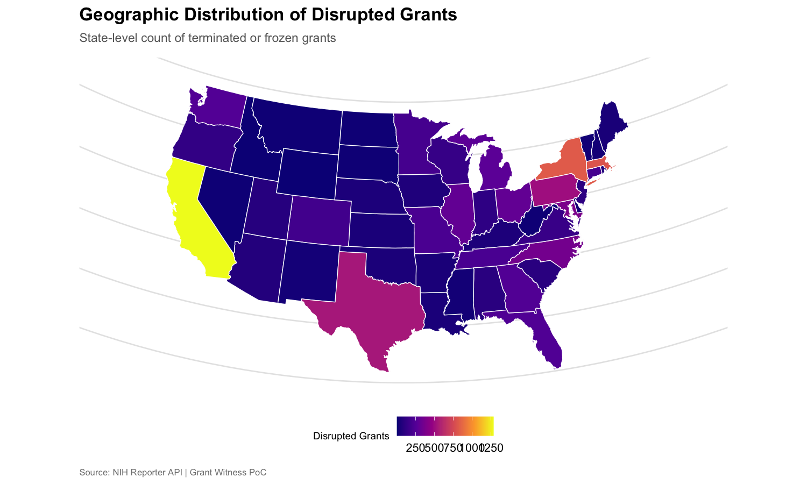

# Grant Witness PoC

A reproducible R data pipeline that cross-references federal grant termination data with official USAspending.gov records to surface discrepancies in government reporting.

Built as a proof-of-concept extension of [Grant Witness](https://grant-witness.us/), demonstrating novel data analysis capabilities beyond the existing platform.

## What This Does

```
NIH Reporter API ──┐                                  ┌── Discrepancy Flags
                    ├── Validate ──┐                   │   - active_despite_terminated
NSF Terminated CSV ─┘              ├── Join & Flag ────┤   - possible_freeze
                                   │                   │   - untracked
USAspending.gov API ── Validate ───┘                   └── Visualizations + Parquet
```

The pipeline discovers grants where **government reporting contradicts observed termination activity**:

- **Active Despite Terminated** — USAspending shows live outlays on a grant that termination notices say is dead
- **Possible Freeze** — Award period is open but disbursements are absent or near-zero (< 10% outlay ratio)
- **Untracked** — Official awards from tracked agencies with no corresponding forensic notice (coverage gaps)

## Novel Contributions

| Capability | Grant Witness | This PoC |
|---|---|---|
| NIH institute-level breakdown | Agency-level only | Per-IC granularity (NIGMS, NIAID, etc.) |
| Obligation vs. outlay analysis | Not available | Detects "frozen in practice" silent stoppages |
| Active-despite-terminated | Not available | Direct contradiction detection |
| Cross-agency comparison | Separate pages | Unified join across NIH + NSF + EPA |
| Geographic distribution | State-level maps | State-level choropleth from NIH Reporter |

## Visualizations

### NIH Institutes by Terminated Grant Count


### Federal Grant Discrepancies by Agency


### Award Amount vs. Outlay Ratio


### Freeze Severity: Elapsed Period vs. Disbursement


### Geographic Distribution


## Latest Results

| Metric | Value |
|---|---|
| NIH terminated grants scraped | 9,063 (deduplicated, active-filtered) |
| NSF terminated awards parsed | 1,667 |
| USAspending awards fetched | 15,000 (HHS + NSF + EPA) |
| Exact matches (grant number) | 489 |
| Fuzzy matches (org name + date) | 2,498 (precision-tuned, see below) |
| Active Despite Terminated | 693 grants |
| Possible Freeze (< 10% outlay) | 4,957 grants |
| Untracked (no forensic notice) | 11,310 grants |

### Data Quality Flags

The pipeline applies 10 automated quality flags across both datasets:

| Flag | Dataset | Description | Count |
|---|---|---|---|
| `flag_negative_outlay` | Awards | Negative outlays (accounting adjustments) | 16 |
| `flag_over_disbursed` | Awards | Outlays > 150% of award amount | 1 |
| `flag_date_inverted` | Awards | End date before start date | 8 |
| `flag_zero_award` | Awards | $0 award amount | 0 |
| `flag_future_date` | Awards | Action date in the future | 37 |
| `flag_cfda_mismatch` | Awards | CFDA prefix doesn't match agency | 0 |
| `flag_international` | Notices | Canadian province (cross-border grant) | 18 |
| `flag_invalid_state` | Notices | Unrecognized state/territory code | 0 |
| `flag_bad_grant_number` | Notices | Malformed grant number for agency | 0 |
| `flag_amount_mismatch` | Joined | >25% gap between notice and USAspending amounts (exact matches only) | 24 |

The discrepancies output also includes:
- **`elapsed_ratio`** — Fraction of award period elapsed (0=just started, 1=expired). Enables triage within `possible_freeze`: 489 grants are >50% elapsed with <10% outlay; 142 are >80% elapsed.

### Fuzzy Join Precision

The fuzzy join uses a two-layer approach to avoid false positives:
1. **Jaro-Winkler threshold** tightened to 0.08 (from 0.15, which had 71% false positive rate)
2. **Distinctive token filter** requires shared non-stopword tokens (blocks "University of X" matching "University of Y")

## Dashboard

**Live:** [sharifhsn.github.io/witness](https://sharifhsn.github.io/witness/)

An interactive Quarto dashboard summarizes the pipeline results. To render locally:

```bash
quarto render dashboard.qmd && open dashboard.html
```

## Running the Pipeline

```r
# Install dependencies
renv::restore()

# Run the full pipeline
targets::tar_make()
```

The pipeline scrapes live data from:
- [NIH Reporter API](https://api.reporter.nih.gov/) — terminated grant projects
- [NSF Terminated Awards CSV](https://nsf-gov-resources.nsf.gov/files/NSF-Terminated-Awards.csv)
- [USAspending.gov API](https://api.usaspending.gov/) — official award records for HHS, NSF, EPA

Output lands in `output/`:
- `discrepancies.parquet` — full joined dataset with discrepancy flags
- `*.png` — visualization plots

## Pipeline DAG

```
notices_nih ─────┐
                 ├─ validated_notices ─┐
notices_nsf ─────┘                     │
                                       ├─ discrepancies ─┬─ discrepancy_summary
usaspending_awards ─ validated_awards ─┘                 ├─ plot_files
                                                         └─ export_parquet
```

## Tech Stack

- **R** with [{targets}](https://docs.ropensci.org/targets/) for reproducible pipeline orchestration
- **httr2** for polite API access (rate limiting, retries, exponential backoff)
- **fuzzyjoin** for Jaro-Winkler string-distance matching across datasets
- **assertr** for runtime data validation
- **ggplot2** with viridis palette matching Grant Witness visual style
- **GitHub Actions** for weekly automated runs

## Project Structure

```
R/
  scrape_nih.R          # NIH Reporter API scraper
  scrape_nsf.R          # NSF Terminated Awards CSV parser
  fetch_usaspending.R   # USAspending.gov award fetcher
  validate.R            # assertr schema enforcement
  transform.R           # Fuzzy join + discrepancy detection
  visualize.R           # ggplot2 charts (GW visual style)
  utils.R               # Shared HTTP, date parsing, logging
tests/
  testthat/test-parsers.R   # 230 tests covering all modules
_targets.R                  # Pipeline orchestration
```

## License

MIT
